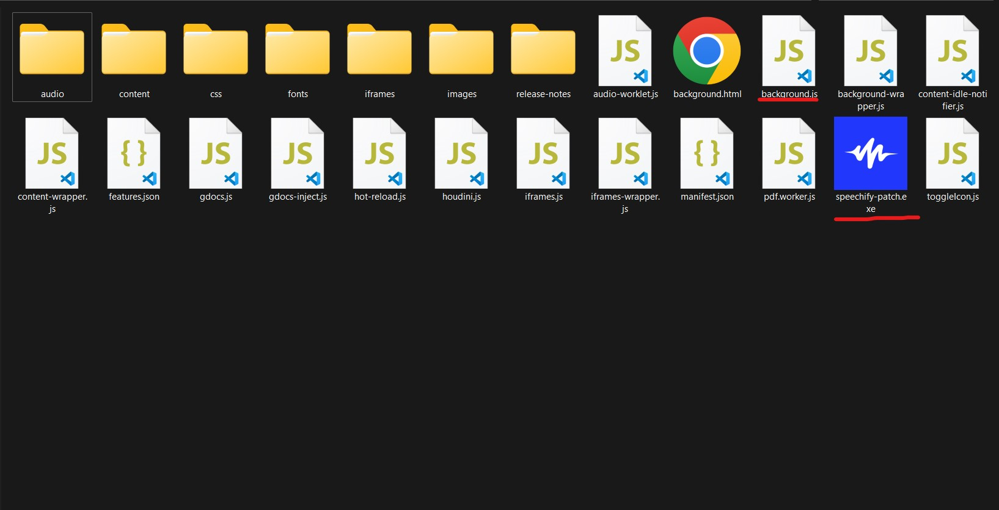

# Speechify Unlimited Patch

# What is Speechify

Speechify is a mobile and desktop app that reads any text aloud using a computer generated text to speech voice. The app is notable for producing near-human quality voices, and for using optical character recognition technology to turn physical books or any printed text into audio.

**This patch only works for Speechify Chrome extension.**

# Disclaimer
This is one of my projects which I did only for fun.
**Please use this for educational propose only.**

# How to use
  1. First install the speechify chrome extension from chrome web store. [speechify.com](https://speechify.com/)

  2. [Find Storage Location for Unpacked Extensions in Chrome Web Browser.](https://stackoverflow.com/a/14544700/15084645)

  3. Copy that folder and paste it into your hard drive and open the folder.
  
  4. copy speechify-patch.exe file into that folder.
  (inside the folder, there is a file called **background.js**)

        

  5. Run the speechify-patch.exe or you can use python file. (.py) 
  [How to Run Your Python Scripts](https://realpython.com/run-python-scripts/)

        if it is successfully patched, it will be shown like this.
        

  6. remove old extension from chrome://extensions/.

  7. Install the new Speechify extension.
  [How does one install an extension for Chrome browser from the local file system](https://www.youtube.com/watch?v=dhaGRJvJAII)

